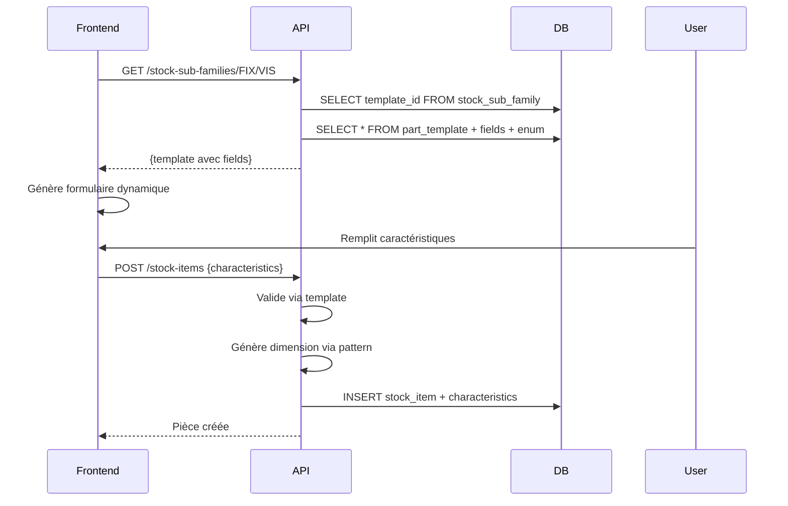

# Sous-familles de stock

> Voir aussi : [Stock Families](stock-families.md) | [Part Templates](part-templates.md) | [Stock Items](stock-items.md)

---

## `GET /stock-sub-families`

Liste toutes les sous-familles avec leurs templates associés.

Si la sous-famille a un `template_id`, le template complet est chargé avec tous ses champs et valeurs enum. Si le template est introuvable, `template` est `null` (pas d'erreur).

### Réponse `200`

```json
[
  {
    "family_code": "FIX",
    "code": "VIS",
    "label": "Vis",
    "template": {
      "id": "uuid",
      "code": "VIS_STANDARD",
      "version": 2,
      "pattern": "{DIAM}x{LONG}-{MAT}",
      "fields": [
        {
          "key": "DIAM",
          "label": "Diamètre",
          "field_type": "number",
          "unit": "mm",
          "required": true,
          "enum_values": null
        },
        {
          "key": "MAT",
          "label": "Matériau",
          "field_type": "enum",
          "unit": null,
          "required": true,
          "enum_values": [
            { "value": "INOX", "label": "Inox A2" },
            { "value": "ACIER", "label": "Acier zingué" }
          ]
        }
      ]
    }
  },
  {
    "family_code": "FIX",
    "code": "ECROU",
    "label": "Écrous",
    "template": null
  }
]
```

---

## `GET /stock-sub-families/{family_code}/{sub_family_code}`

Récupère une sous-famille spécifique avec son template.

### Réponse `200` — StockSubFamily

```json
{
  "family_code": "FIX",
  "code": "VIS",
  "label": "Vis",
  "template": { "...": "..." }
}
```

### Erreurs

| Code | Cas                      |
| ---- | ------------------------ |
| 404  | Sous-famille introuvable |

---

## `POST /stock-sub-families`

Crée une nouvelle sous-famille avec `family_code` dans le body.

### Entrée

```json
{
  "family_code": "ECR",
  "code": "STD",
  "label": "Standards",
  "template_id": "uuid"
}
```

| Champ         | Type   | Requis | Description                      |
| ------------- | ------ | ------ | -------------------------------- |
| `family_code` | string | oui    | Code de la famille (max 20)      |
| `code`        | string | oui    | Code de la sous-famille (max 20) |
| `label`       | string | non    | Libellé                          |
| `template_id` | UUID   | non    | Template à associer              |

### Réponse `201` — StockSubFamily

### Erreurs

| Code | Cas                         |
| ---- | --------------------------- |
| 409  | La sous-famille existe déjà |
| 500  | Erreur base de données      |

---

## `POST /stock-sub-families/{family_code}`

Crée une nouvelle sous-famille avec le `family_code` dans l'URL. C'est le format utilisé par le frontend.

### Entrée

```json
{
  "code": "STD",
  "label": "Standards",
  "template_id": "uuid"
}
```

| Champ         | Type   | Requis | Description                      |
| ------------- | ------ | ------ | -------------------------------- |
| `code`        | string | oui    | Code de la sous-famille (max 20) |
| `label`       | string | non    | Libellé                          |
| `template_id` | UUID   | non    | Template à associer              |

### Réponse `201` — StockSubFamily

### Erreurs

| Code | Cas                         |
| ---- | --------------------------- |
| 409  | La sous-famille existe déjà |
| 500  | Erreur base de données      |

---

## `PATCH /stock-sub-families/{family_code}/{sub_family_code}`

Met à jour le label et/ou le template d'une sous-famille existante. Tous les champs sont optionnels.

### Entrée

| Champ         | Type   | Description                                         |
| ------------- | ------ | --------------------------------------------------- |
| `label`       | string | Nouveau libellé                                     |
| `template_id` | UUID?  | UUID du template à associer (`null` pour dissocier) |

### Exemples

```json
{ "label": "Vis et fixations" }
```

```json
{ "template_id": "123e4567-e89b-12d3-a456-426614174000" }
```

```json
{ "template_id": null }
```

### Réponse `200` — StockSubFamily

Retourne la sous-famille mise à jour avec le template hydraté.

### Erreurs

| Code | Cas                      |
| ---- | ------------------------ |
| 404  | Sous-famille introuvable |
| 500  | Erreur base de données   |

---

## Schéma StockSubFamily

| Champ         | Type          | Description                                |
| ------------- | ------------- | ------------------------------------------ |
| `family_code` | string        | Code de la famille                         |
| `code`        | string        | Code de la sous-famille                    |
| `label`       | string        | Libellé                                    |
| `template`    | PartTemplate? | Template complet associé (`null` si aucun) |

Voir [part-templates.md](part-templates.md) pour le schéma `PartTemplate`.

**Hydratation :** Si la sous-famille a un `template_id`, le template complet est chargé avec tous ses champs et valeurs enum.

### Réponse

```json
[
  {
    "family_code": "FIX",
    "code": "VIS",
    "label": "Vis",
    "template": {
      "id": "123e4567-e89b-12d3-a456-426614174000",
      "code": "VIS_STANDARD",
      "version": 2,
      "pattern": "{DIAM}x{LONG}-{MAT}",
      "fields": [
        {
          "key": "DIAM",
          "label": "Diamètre",
          "field_type": "number",
          "unit": "mm",
          "required": true,
          "enum_values": null
        },
        {
          "key": "LONG",
          "label": "Longueur",
          "field_type": "number",
          "unit": "mm",
          "required": true,
          "enum_values": null
        },
        {
          "key": "MAT",
          "label": "Matériau",
          "field_type": "enum",
          "unit": null,
          "required": true,
          "enum_values": [
            { "value": "INOX", "label": "Inox A2" },
            { "value": "ACIER", "label": "Acier zingué" }
          ]
        }
      ]
    }
  },
  {
    "family_code": "FIX",
    "code": "ECROU",
    "label": "Écrous",
    "template": null
  }
]
```

**Note :** `"template": null` si la sous-famille n'a pas de template associé (mode legacy).

---

## GET /stock-sub-families/{family_code}/{sub_family_code}

Récupère une sous-famille spécifique avec son template.

**Paramètres :**

- `family_code` (path) : Code de la famille
- `sub_family_code` (path) : Code de la sous-famille

### Exemple

```bash
GET /stock-sub-families/FIX/VIS
```

### Réponse

```json
{
  "family_code": "FIX",
  "code": "VIS",
  "label": "Vis",
  "template": {
    "id": "123e4567-e89b-12d3-a456-426614174000",
    "code": "VIS_STANDARD",
    "version": 2,
    "pattern": "{DIAM}x{LONG}-{MAT}",
    "fields": [
      {
        "key": "DIAM",
        "label": "Diamètre",
        "field_type": "number",
        "unit": "mm",
        "required": true,
        "enum_values": null
      },
      {
        "key": "LONG",
        "label": "Longueur",
        "field_type": "number",
        "unit": "mm",
        "required": true,
        "enum_values": null
      },
      {
        "key": "MAT",
        "label": "Matériau",
        "field_type": "enum",
        "unit": null,
        "required": true,
        "enum_values": [
          { "value": "INOX", "label": "Inox A2" },
          { "value": "ACIER", "label": "Acier zingué" }
        ]
      }
    ]
  }
}
```

### Erreur (404)

```json
{
  "detail": "Sous-famille FIX/INVALID non trouvée"
}
```

---

## PATCH /stock-sub-families/{family_code}/{sub_family_code}

Met à jour une sous-famille de stock (label et/ou template associé).

**Paramètres :**

- `family_code` (path) : Code de la famille
- `sub_family_code` (path) : Code de la sous-famille

**Body :** Tous les champs sont optionnels

| Champ         | Type   | Description                                       |
| ------------- | ------ | ------------------------------------------------- |
| `label`       | string | Nouveau libellé de la sous-famille                |
| `template_id` | UUID?  | UUID du template à associer (null pour dissocier) |

### Exemple : Modifier le label

```bash
PATCH /stock-sub-families/FIX/VIS
Content-Type: application/json

{
  "label": "Vis et fixations"
}
```

### Exemple : Associer un template

```bash
PATCH /stock-sub-families/FIX/VIS
Content-Type: application/json

{
  "template_id": "123e4567-e89b-12d3-a456-426614174000"
}
```

### Exemple : Dissocier un template

```bash
PATCH /stock-sub-families/FIX/VIS
Content-Type: application/json

{
  "template_id": null
}
```

### Réponse (200)

Retourne la sous-famille mise à jour avec son template hydraté :

```json
{
  "family_code": "FIX",
  "code": "VIS",
  "label": "Vis et fixations",
  "template": {
    "id": "123e4567-e89b-12d3-a456-426614174000",
    "code": "VIS_STANDARD",
    "version": 2,
    "pattern": "{DIAM}x{LONG}-{MAT}",
    "fields": [...]
  }
}
```

### Erreur (404)

```json
{
  "detail": "Sous-famille FIX/INVALID non trouvée"
}
```

---

## Utilisation

### 1. Lister les sous-familles pour sélection

```javascript
// Frontend : Afficher dropdown des sous-familles
const response = await fetch("/stock-sub-families");
const subFamilies = await response.json();

subFamilies.forEach((sf) => {
  console.log(`${sf.family_code}/${sf.code} - ${sf.label}`);
  if (sf.template) {
    console.log(`  → Template: ${sf.template.code} v${sf.template.version}`);
  } else {
    console.log(`  → Mode legacy (saisie libre)`);
  }
});
```

### 2. Récupérer template pour formulaire dynamique

```javascript
// Quand l'utilisateur sélectionne une sous-famille
const response = await fetch("/stock-sub-families/FIX/VIS");
const subFamily = await response.json();

if (subFamily.template) {
  // Générer formulaire dynamique basé sur template.fields
  subFamily.template.fields.forEach((field) => {
    if (field.field_type === "number") {
      createNumberInput(field.key, field.label, field.unit, field.required);
    } else if (field.field_type === "enum") {
      createSelectInput(
        field.key,
        field.label,
        field.enum_values,
        field.required,
      );
    } else {
      createTextInput(field.key, field.label, field.required);
    }
  });
} else {
  // Afficher formulaire legacy (dimension manuelle)
  createTextInput("dimension", "Dimension", true);
}
```

---

## Schéma StockSubFamily

| Champ         | Type          | Description                       |
| ------------- | ------------- | --------------------------------- |
| `family_code` | string        | Code de la famille                |
| `code`        | string        | Code de la sous-famille           |
| `label`       | string        | Libellé                           |
| `template`    | PartTemplate? | Template associé (null si legacy) |

Voir [part-templates.md](part-templates.md) pour le schéma `PartTemplate`.

---

## Flux avec création de pièce


```mermaid
sequenceDiagram
    Frontend->>API: GET /stock-sub-families/FIX/VIS
    API->>DB: SELECT template_id FROM stock_sub_family
    API->>DB: SELECT * FROM part_template + fields + enum
    API-->>Frontend: {template avec fields}

    Frontend->>Frontend: Génère formulaire dynamique
    User->>Frontend: Remplit caractéristiques

    Frontend->>API: POST /stock-items {characteristics}
    API->>API: Valide via template
    API->>API: Génère dimension via pattern
    API->>DB: INSERT stock_item + characteristics
    API-->>Frontend: Pièce créée
```

---

## Voir aussi

- [stock-items.md](stock-items.md) — Création pièces avec/sans template
- [part-templates.md](part-templates.md) — Gestion des templates
- [shared-schemas.md](shared-schemas.md) — Schémas partagés
